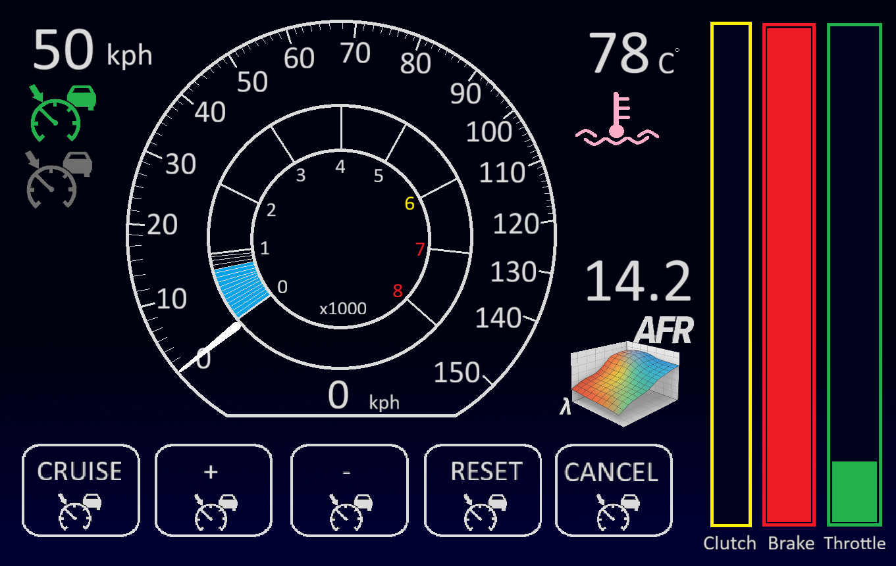

   

There are two main approaches to building a Qt project for the Raspberry Pi, and the recommended method for most users is Native Compilation.

1. 🖥️ Native Compilation (Recommended)
This is the simpler method. The source code is copied to the Raspberry Pi and used with the Qt tools installed on the Pi itself to build the executable directly for its own architecture.

A. Preparation on the Raspberry Pi
Install Required Tools: Ensure the Pi is up-to-date and has the necessary build tools and Qt development packages installed.

Bash

sudo apt update
sudo apt install build-essential cmake qt6-base-dev qt6-tools qt6-base-examples
*(The qt6-base-dev package installs the headers and tools needed for compilation).

Clone the Project: Use Git to clone the repository onto the Raspberry Pi.

Bash

cd ~
git clone https://github.com/toschomacher/VehicleDashboardGUI.git
cd VehicleDashboardGUI
B. Building the Release Executable
Create a Build Directory: It's best practice to build outside the source directory.

Bash

mkdir build_pi
cd build_pi
Run CMake (or QMake, depending on your project file): Qt 6 projects generally use CMake. The CMAKE_BUILD_TYPE=Release flag is crucial for creating the optimised Release version.

Bash

cmake ../src/SecondTestGUI -DCMAKE_BUILD_TYPE=Release
Compile the Code:

Bash

make -j$(nproc)
(-j$(nproc) uses all available CPU cores for a faster build).

C. Running the Executable
Once the build is complete, the executable (appSecondTestGUI or similar) will be inside the build_pi directory.

Run the application:

Bash

./appSecondTestGUI
2. 🚀 Deployment on Linux (The windeployqt equivalent)
Unlike Windows, Linux executables compiled against system libraries (like the ones installed via apt) often run fine on other machines with the same Linux distribution and libraries installed (e.g., Raspberry Pi OS on another Pi).

If the application needs to be distributed to a Pi without the full Qt development environment, a deployment tool can be used or a package manager approach:

Install Required Libraries on the Target Pi: If the application is missing DLLs (libraries), the ldd command can be used to find out what's missing, and then install the corresponding packages:

Bash

ldd ./appSecondTestGUI
# Example: If it says libQt6Widgets.so.6 is missing, you would use:
sudo apt install libqt6widgets6
Use linuxdeployqt (Advanced): This tool, which is conceptually similar to windeployqt, creates a self-contained application bundle (like an AppImage) that includes all necessary libraries and plugins. This requires a more complex setup but results in a fully portable executable.

Alternative: Cross-Compilation (Most Complex)
This method involves setting up a dedicated toolchain on your Windows PC that can build ARM executables for the Pi. This is fast for iterative compiling but is extremely complicated to set up initially, requiring:

Installing a Linux distribution (via WSL or VM).

Downloading a Cross-Compiler (e.g., aarch64-linux-gnu-gcc).

Creating a Sysroot (a mirror of the Pi's essential file system).

Compiling the entire Qt framework from source for the target Pi architecture.

This is only recommended if you are doing frequent, high-volume development and the native compile speed on the Pi is too slow.

The video below explains the process for cross-compiling Qt for Raspberry Pi from a Linux host, which shares many of the same challenging steps you'd face from Windows. Qt For Raspberry Pi - Qt 6.6.1 Cross Compilation with Docker isolation Easy way ! This video is relevant because it demonstrates the complexity of setting up a cross-compilation environment for Qt on the Raspberry Pi, which is an alternative to native compilation.
https://www.youtube.com/watch?v=5XvQ_fLuBX0
